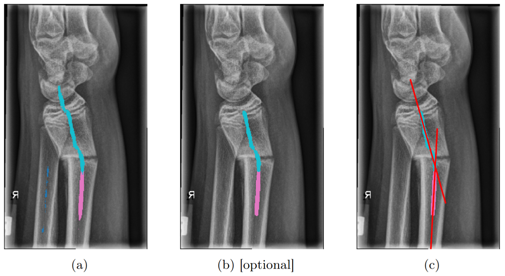

# A New Angle on Bones: Robust Pose Estimation in X-Ray and Ultrasound

We propose a method for robust bone pose estimation.
A deep learning model proposed point candidates for each bone structure of interest (a).
From those candidates, a robust line model extract the axes, allowing the extraction of their angle (c).
Depending on the line model, we also introduce different commonly used methods for false-positive reduction (b).



We implement our method with pytorch lightning and utilize for classic computer vision kornia and skimage.

## Extension of GrazPedWriDataset with Fracture Fragment Angle Estimation

Please download the dataset using the provided link in the
original [paper](https://www.nature.com/articles/s41597-022-01328-z) and preprocess it with their provided notebooks to
obtain the 8-bit images.
After that place it into `dataset/data/img8bit`.
The physicians in our team (one radiologist and three paediatric surgeons) extend a subset of 231 radiographs with
oriented bounding boxes for the fracture fragments of ulna and radius, resulting in a maximum of four boxes per
radiograph.
By averaging the top and bottom corners, we obtain two points representing the axis of a fragment.
Those points were then used to generate the ground truth by drawing a one-pixel line between them (point candidates) or
use them directly for the landmark detection.
Subsequently, the fragment axes are used to compute the corresponding angles for fractures of radius and ulna,
respectively.

## Training

Train the model to predict point candidates via

```bash
python -m train_line_seg --config configs/line_seg_graz.yaml
```

and for landmark detection via heatmap regression via

```bash
python -m train_heatmap --config configs/heatmap_reg_graz.yaml
```

## Evaluation

All our evaluation scripts based on a precomputation of the angle errors of all samples. To create those for point
candidate-based methods use:

```bash
python -m evaluation.quantitative_line_seg_evaluation [dataset] [false-positive reduction] [line model]
```

where you can list the available options with `-h`.
For landmark-based use

```bash
python -m evaluation.quantitative_keypoints_evaluation [dataset]
```

After that you can calculate the statistics using `evaluation/plot_statistics.py` and test for significance with `evaluation/rank_methods.py`.